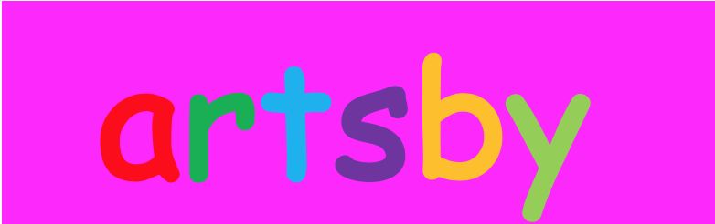

# Artsby

Artsby is a Gatsby boilerplate for digital art exhibits (it generates static sites, so it’s ideal for things like [p5.js](https://p5js.org/) sketches or anything without a server).

This is based on a framework I built for the [generative unfoldings](https://generative-unfoldings.mit.edu/) exhibit at MIT. It’s designed to be easily set up, and hopefully the CSS isn’t too dense already, but I simply can’t be bothered to fix it so that’s up to you.

## Setup

Clone the repo and run `npm install`.

In `static/works`, put folders containing your digital artworks. As long as there’s an index.html at the root of the folder, it should display fine when the site builds.

In `static/data`, put your exhibit info in about.json (it takes HTML), and each artist’s info in work_info.json - the `url` attribute should be the name of the artwork’s folder in `static/works`.

In `static/img`, for the homepage, you can put images of each artwork titled with the same name as the artwork’s folder in `static/works`, and it’ll auto-populate the homepage with them.

Once everything’s set up, run `setup.sh` - this just copies the index.html files from the works to the src folder, because I haven’t found a less dumb way to get this to work.

Bing bang boom you’ve got an art exhibit! 

You’ll have to run `gatsby build` once to get everything in the right place, but then you can play around with it -

Run `gatsby develop` to get your development site running, and `gatsby build` to create the final version when you’re satisfied. A sample site
